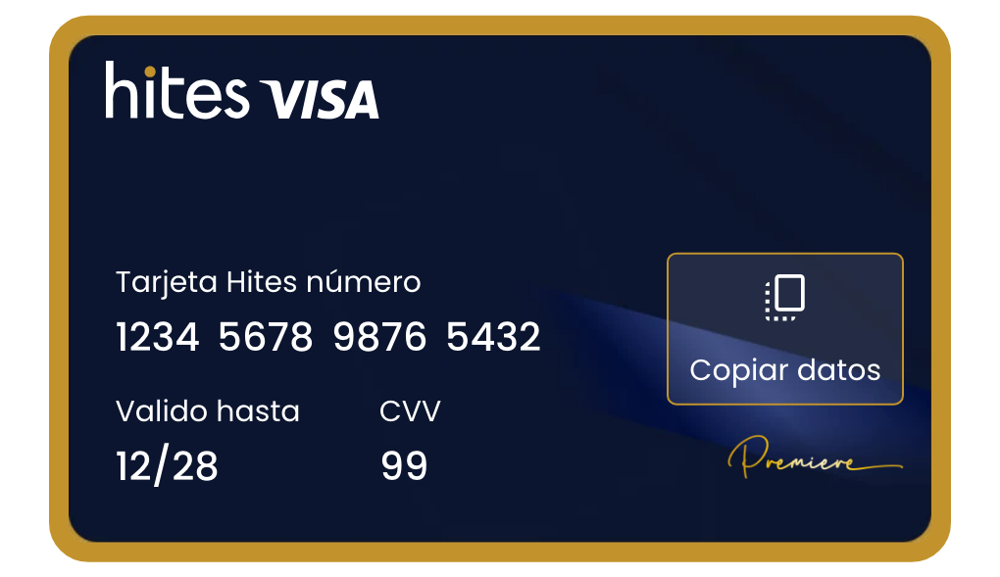

# hitespass-pomelo-style

Estilos de la tarjeta para el iframe de datos seguros de Pomelo/Visa.




## Cómo editar

Se edita `styles.src.css` y se corre:

```bash
./build.sh
```

Eso genera `styles.css` con las cuatro imágenes incrustadas en base64. `styles.css` no se edita a mano.

Las imágenes salen de la librería `hites-pass-ui` (https://gitlab.com/hites/credito/hites-pass/hites-pass-ui), sin modificar.

Las imágenes se incrustan en base64 para que el iframe no tenga que hacer requests aparte, lo cual baja el tiempo de carga de 900 ms a 600 ms.

## Archivos

| Archivo | Qué es |
|---|---|
| `styles.src.css` | fuente, se edita |
| `build.sh` | incrusta las imágenes y genera el final |
| `styles.css` | generado, es lo que Pomelo descarga |
| `card_background.webp` | fondo de la tarjeta, 2x |
| `card_brand.webp` | sello Premiere, 2x |
| `card_wordmark.svg` | marca hites VISA |
| `copy_all.svg` | ícono de copiar |
| `capture.sh` | regenera `preview.png` desde el `styles.css` actual |
| `preview.png` | ejemplo de cómo se ve, generado |
